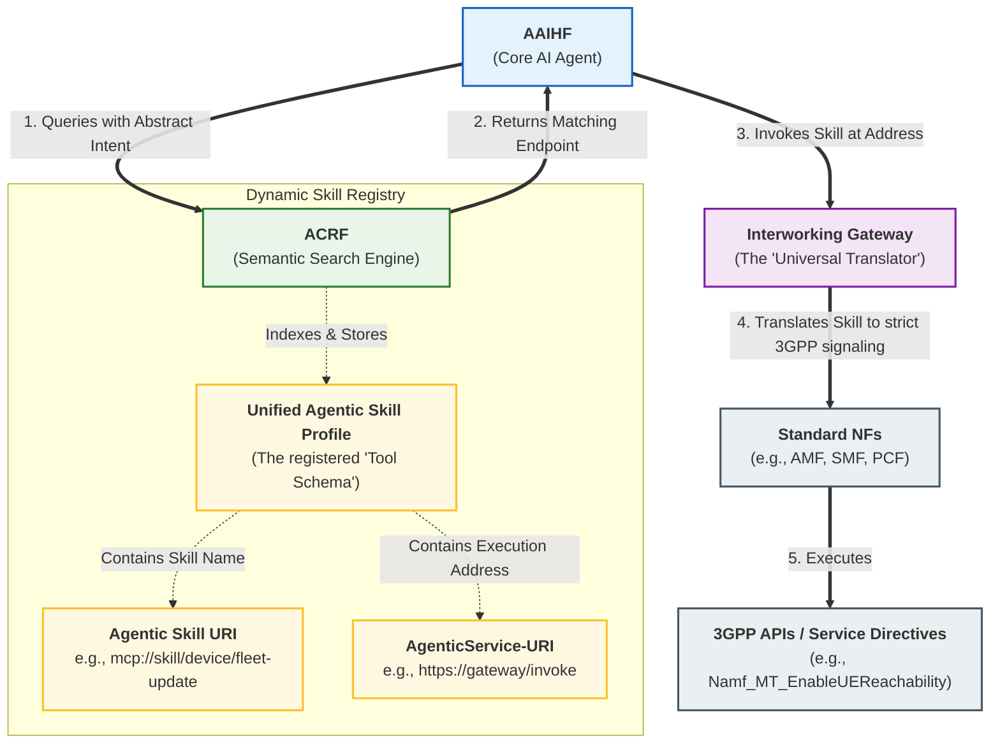
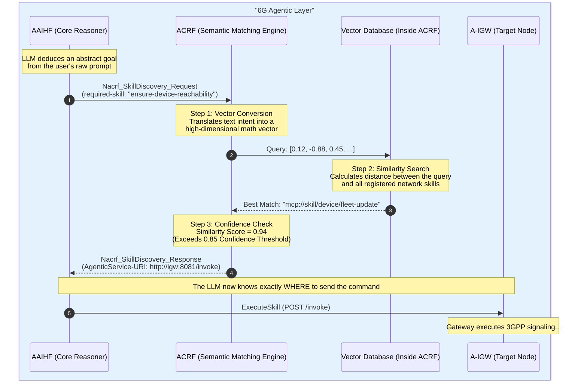

# 下一阶段实现设计
## ACRF逐步做实
### 逻辑视图

```mermaid
graph TD
    %% Define Styles
    classDef ai fill:#e3f2fd,stroke:#1565c0,stroke-width:2px;
    classDef registry fill:#e8f5e9,stroke:#2e7d32,stroke-width:2px;
    classDef data fill:#fff8e1,stroke:#fbc02d,stroke-width:2px;
    classDef gateway fill:#f3e5f5,stroke:#7b1fa2,stroke-width:2px;
    classDef network fill:#eceff1,stroke:#455a64,stroke-width:2px;

    %% Nodes
    AAIHF["<b>AAIHF</b><br/>(Core AI Agent)"]:::ai
    
    subgraph "Dynamic Skill Registry"
        ACRF["<b>ACRF</b><br/>(Semantic Search Engine)"]:::registry
        Profile["<b>Unified Agentic Skill Profile</b><br/>(The registered 'Tool Schema')"]:::data
        URI["<b>Agentic Skill URI</b><br/>e.g., mcp://skill/device/fleet-update"]:::data
        Endpoint["<b>AgenticService-URI</b><br/>e.g., https://gateway/invoke"]:::data
        
        ACRF -. "Indexes & Stores" .-> Profile
        Profile -. "Contains Skill Name" .-> URI
        Profile -. "Contains Execution Address" .-> Endpoint
    end

    IGW["<b>Interworking Gateway</b><br/>(The 'Universal Translator')"]:::gateway
    NF["<b>Standard NFs</b><br/>(e.g., AMF, SMF, PCF)"]:::network
    APIs["<b>3GPP APIs / Service Directives</b><br/>(e.g., Namf_MT_EnableUEReachability)"]:::network

    %% Flow
    AAIHF == "1. Queries with Abstract Intent" ==> ACRF
    ACRF == "2. Returns Matching Endpoint" ==> AAIHF
    AAIHF == "3. Invokes Skill at Address" ==> IGW
    IGW == "4. Translates Skill to strict 3GPP signaling" ==> NF
    NF == "5. Executes" ==> APIs
```

### 时序图

```mermaid
sequenceDiagram
    autonumber
    
    box rgb(227, 242, 253) "6G Agentic Layer"
    participant AAIHF as AAIHF (Core Reasoner)
    participant ACRF as ACRF (Semantic Matching Engine)
    participant VDB as Vector Database (Inside ACRF)
    participant IGW as A-IGW (Target Node)
    end

    Note over AAIHF: LLM deduces an abstract goal<br/>from the user's raw prompt
    
    AAIHF->>ACRF: Nacrf_SkillDiscovery_Request<br/>(required-skill: "ensure-device-reachability")
    
    Note over ACRF: Step 1: Vector Conversion<br/>Translates text intent into a<br/>high-dimensional math vector
    
    ACRF->>VDB: Query: [0.12, -0.88, 0.45, ...]
    
    Note over VDB: Step 2: Similarity Search<br/>Calculates distance between the query<br/>and all registered network skills
    
    VDB-->>ACRF: Best Match: "mcp://skill/device/fleet-update"
    
    Note over ACRF: Step 3: Confidence Check<br/>Similarity Score = 0.94<br/>(Exceeds 0.85 Confidence Threshold)
    
    ACRF-->>AAIHF: Nacrf_SkillDiscovery_Response<br/>(AgenticService-URI: http://igw:8081/invoke)
    
    Note over AAIHF, IGW: The LLM now knows exactly WHERE to send the command
    AAIHF->>IGW: ExecuteSkill (POST /invoke)
    
    Note over IGW: Gateway executes 3GPP signaling...
```
