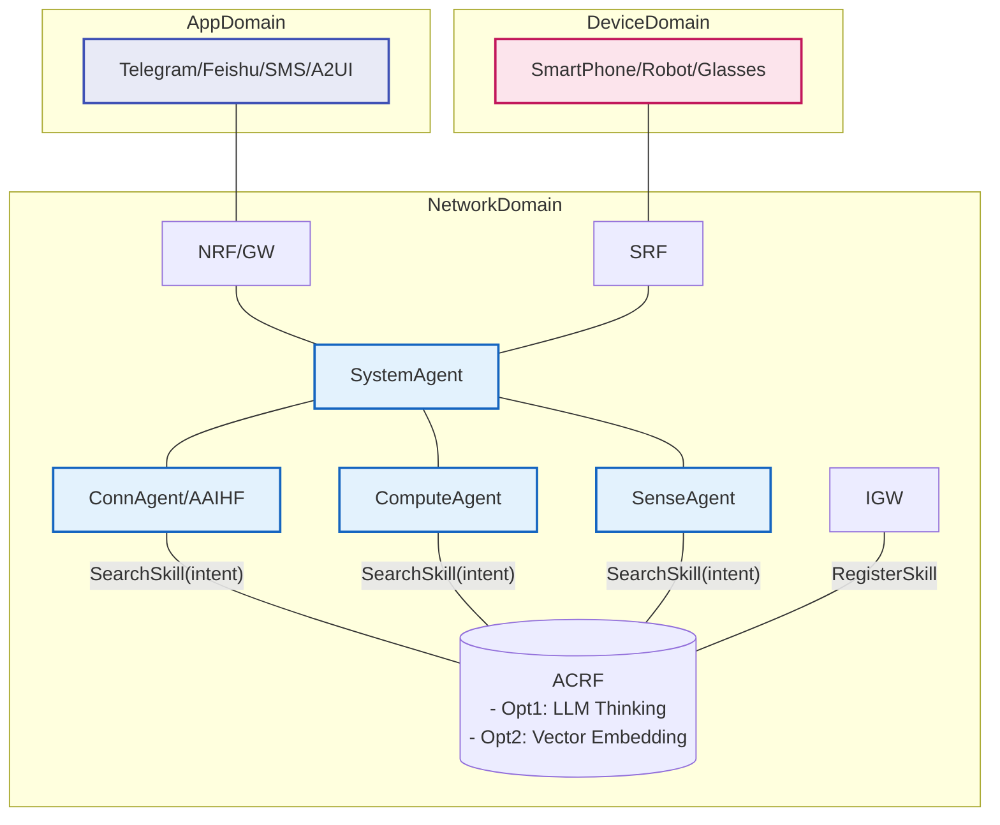

<Info>
  和贾博、庆阳的实现融合，关键差异：

  1. Skill匹配：LLM thinking VS Vector embedding
  2. Skill执行：LLM React VS 预编程
</Info>

# 逻辑视图

```mermaid placement="bottom-right"
flowchart TD
    classDef device fill:#fce4ec,stroke:#c2185b,stroke-width:2px;
    classDef app fill:#e8eaf6,stroke:#3f51b5,stroke-width:2px;
    classDef agent fill:#e3f2fd,stroke:#1565c0,stroke-width:2px;
    classDef core fill:#fff8e1,stroke:#fbc02d,stroke-width:2px;

    subgraph DeviceDomain
    UE["SmartPhone/Robot/Glasses"]:::device
    end

    subgraph AppDomain
    App["Telegram/Feishu/SMS/A2UI"]:::app
    end

    subgraph NetworkDomain
    SystemAgent:::agent
    SRF
    ConnAgent["ConnAgent/AAIHF"]:::agent
    ComputeAgent:::agent
    SenseAgent:::agent
    ACRF[("ACRF<br/>- Opt1: LLM Thinking<br/>- Opt2: Vector Embedding")]
    IGW

    App --- NEF["NRF/GW"]
    NEF --- SystemAgent
    
    SystemAgent --- ConnAgent
    SystemAgent --- ComputeAgent
    SystemAgent --- SenseAgent

    UE --- SRF
    SRF --- SystemAgent
    
    ConnAgent ---|"SearchSkill(intent)"| ACRF
    ComputeAgent ---|"SearchSkill(intent)"| ACRF
    SenseAgent ---|"SearchSkill(intent)"| ACRF

    IGW ---|"RegisterSkill"| ACRF
    end
```