# Free6GC Initial Prototype Design

Status: initial review draft

Source proposal: `proposal.md`

This document defines the first executable prototype design for a Free6GC core network based on the Free5GC codebase. It is intentionally scoped to a narrow initial-registration vertical slice. The goal is to prove the proposed 6G architecture through a deep refactor, not through an overlay around the existing monolithic AMF/SMF.

## 1. Codex Initial Context Prompt

Use this prompt at the start of each Codex session working on this project:

```text
We are building a 6G core network prototype, called Free6GC, based on our fork of Free5GC.

Read these files first:
- /root/proj/go/orange-prototype-wiki/proposal.md
- /root/proj/go/orange-prototype-wiki/free6gc-initial-design.md
- Relevant Free5GC source under /root/proj/go/free5gc-compose/base/free5gc

Architectural direction:
- This is a deep refactor, not an overlay prototype.
- Keep UE/gNB compatibility with current Free5GC/UERANSIM for milestone 1.
- SRF terminates NGAP/SCTP and forwards raw NAS PDUs plus RAN metadata to GCF.
- GCF owns procedure transaction state and orchestrates atomic services.
- Atomic services expose gRPC/Protobuf APIs.
- Atomic services keep service-local in-memory UE context for milestone 1.
- Source .proto contracts live in free6gc-system/specs/proto.
- Generated Go API clients should be published through a shared module such as free6gc-api-go.
- GCF uses static config for service endpoints in milestone 1.

Milestone 1 scope:
- Implement initial registration only.
- Do not implement PDU session establishment unless explicitly assigned.
- Do not keep AMF as the runtime owner of registration logic.
- Extract or reuse Free5GC code inside new service boundaries where possible.

Primary principle:
Keep procedure logic in GCF, protocol routing in SRF, NAS encode/decode in NAS Codec Service, NAS crypto/security context in NAS Security Service, authentication/SEAF in Authentication Service, subscription access in Subscription Service, access restriction in Mobility Restriction Service, and GUTI/TA/registration context in Mobility Management Service.

Before editing, inspect the existing code path and identify the exact Free5GC functions being moved or adapted. Preserve unrelated user changes.
```

## 2. Architecture Decisions

1. Prototype style: deep refactor, not overlay.
2. First milestone: narrow initial-registration vertical slice.
3. External compatibility: keep Free5GC/UERANSIM NGAP/NAS compatibility.
4. Runtime entry point: SRF terminates NGAP/SCTP.
5. NAS handling boundary: SRF forwards raw NAS PDUs plus metadata to GCF.
6. Procedure ownership: GCF owns procedure transaction state.
7. Internal API style: gRPC/Protobuf.
8. Contract authority: `.proto` source files live in `free6gc-system/specs/proto`.
9. Generated clients: a shared Go API module, for example `free6gc-api-go`.
10. Endpoint resolution: static config for milestone 1.
11. NAS protocol boundary: NAS Codec Service handles NAS encode/decode.
12. NAS security boundary: NAS Security Service handles NAS security context, integrity, ciphering, and NAS counts.
13. Authentication boundary: Authentication Service owns Authentication/SEAF responsibilities.
14. Atomic service state: service-local in-memory UE context for milestone 1.

## 3. 4+1 Architecture Views

The proposal already defines the logical view: a hierarchical architecture with Routing Services, Global Coordination Services, and Atomic Modular Services. This document adds the development, process, physical, and scenario views for the first prototype.

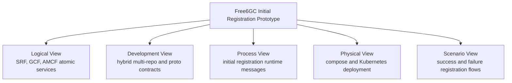

### 3.1 Logical View Summary

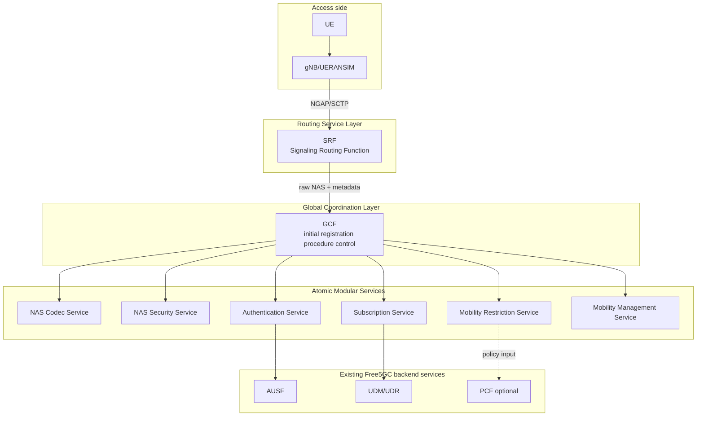

## 4. Development View

### 4.1 Repository Model

Use a hybrid multi-repo model.

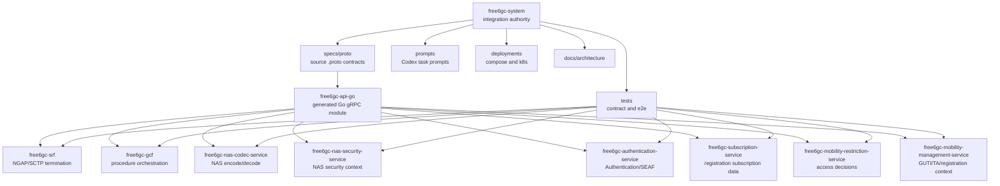

### 4.2 Source Extraction Map

Initial Free5GC reference points:

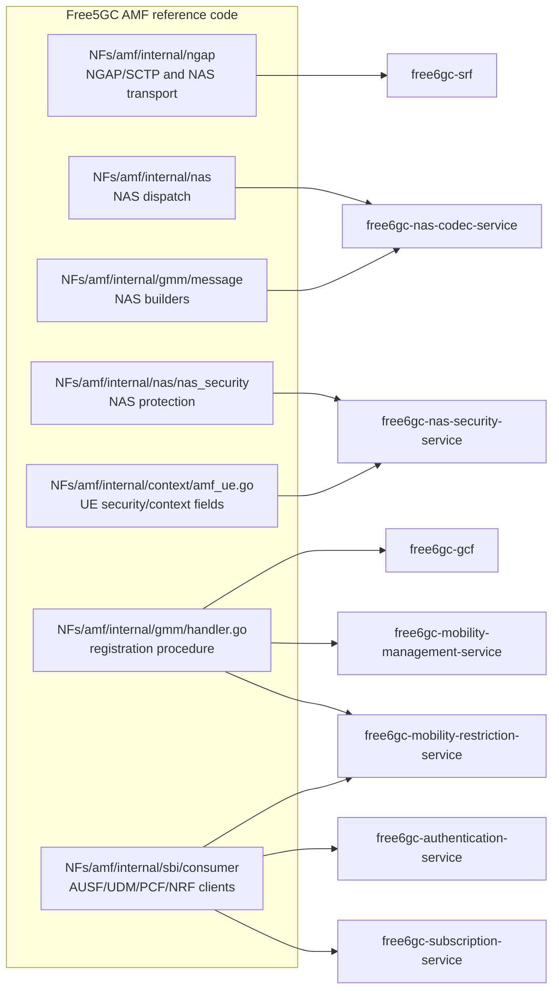

The first refactor should not copy an entire AMF into every service. Each service should import or extract only the code needed for its own responsibility.

### 4.3 Ownership Rules

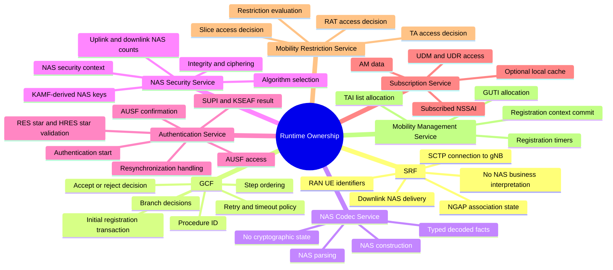

## 5. Process View

### 5.1 Initial Registration Sequence

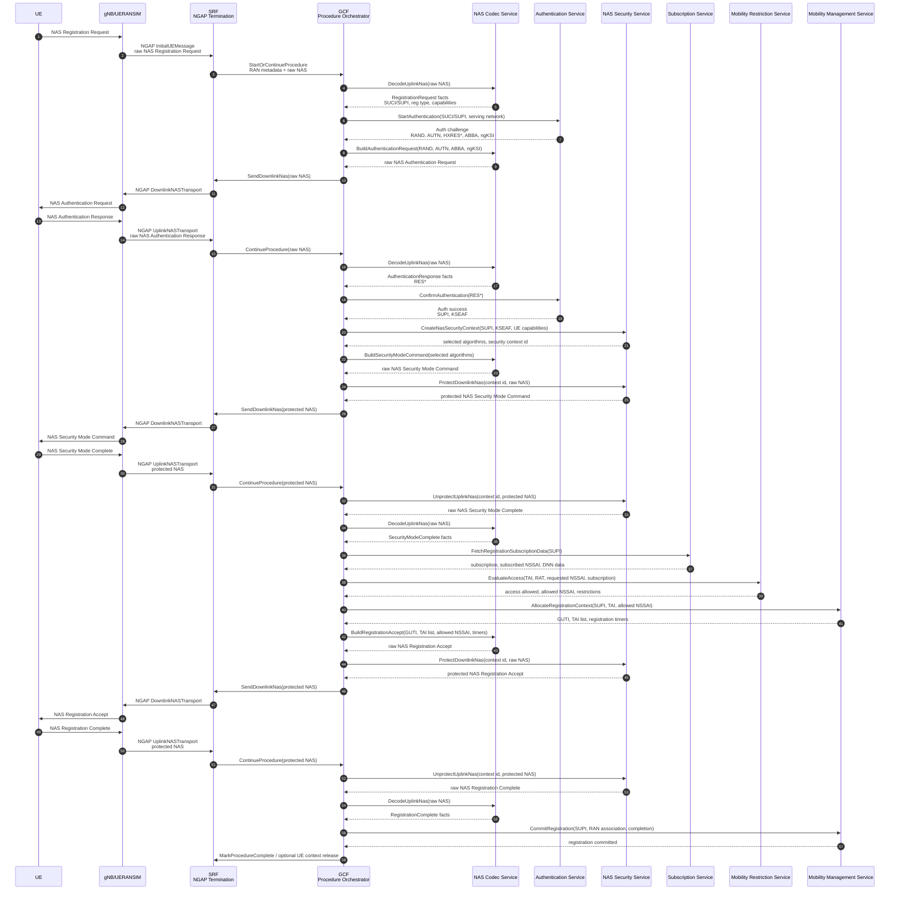

### 5.2 Communication Diagram

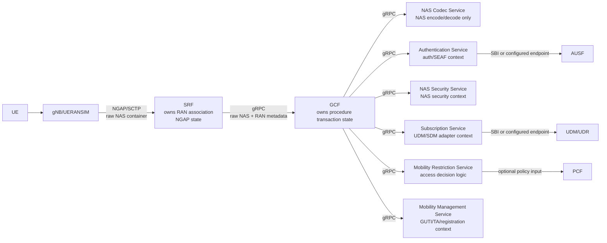

### 5.3 Process Rules

- SRF must not branch on NAS registration semantics except for minimal correlation required to route messages.
- GCF must not parse ASN.1 NGAP.
- GCF should not import NAS bit-level encoding packages directly.
- GCF should be able to replay a procedure from a transaction log in tests.
- Atomic services should return typed outcomes, not direct NAS messages, unless their responsibility is NAS encoding/security.
- Every GCF to service request should carry `procedure_id`.
- Every service response should carry enough decision data for GCF to advance or reject the procedure.

## 6. Physical View

### 6.1 Milestone 1 Docker Compose Deployment

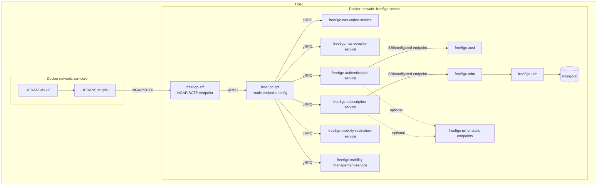

Milestone 1 should not run legacy `free5gc-amf` for the registration path. It may remain available only as a reference or comparison target.

SMF and UPF are not required for initial registration unless the scenario is extended to PDU session establishment.

### 6.2 Target Kubernetes Deployment

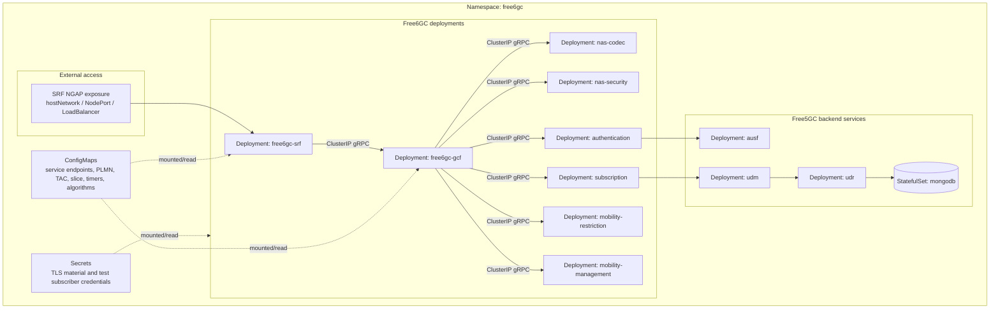

### 6.3 Scaling Model

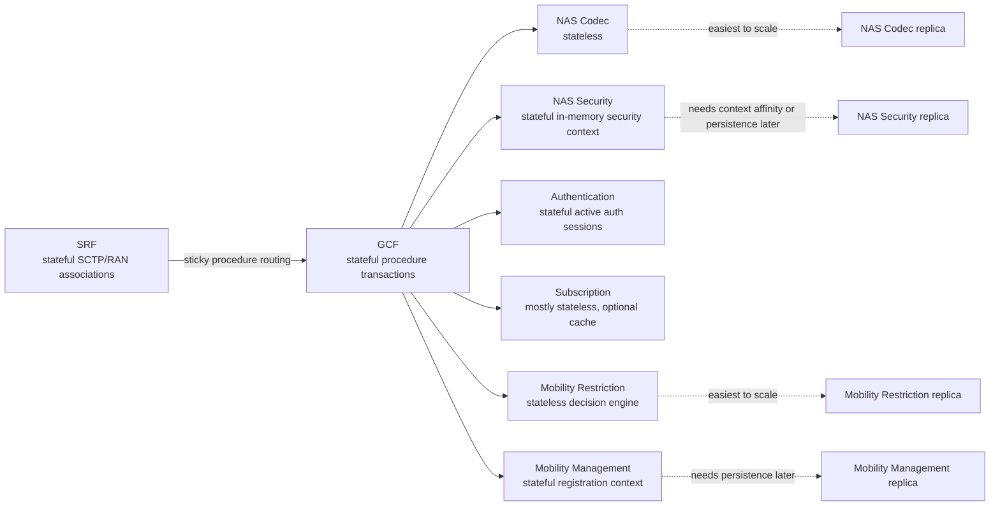

## 7. Scenario View

### 7.1 Scenario: Successful Initial Registration

Preconditions:

- UERANSIM UE and gNB are configured with a test SUPI/SUCI compatible with subscriber data.
- SRF is reachable by gNB over NGAP/SCTP.
- GCF has static endpoints for all atomic services.
- Authentication Service can reach AUSF or equivalent authentication backend.
- Subscription Service can reach UDM/UDR or equivalent subscriber backend.
- Atomic services are empty or reset before test start.

Main flow:

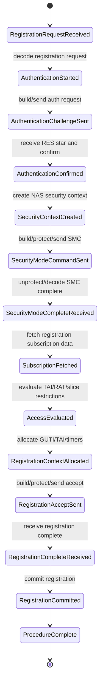

Success criteria:

- UE reaches registered state.
- GCF transaction state is complete.
- Mobility Management Service has committed registration context.
- NAS Security Service has a valid security context.
- SRF can correlate all uplink/downlink NAS transports for the RAN UE association.

### 7.2 Scenario: Authentication Failure

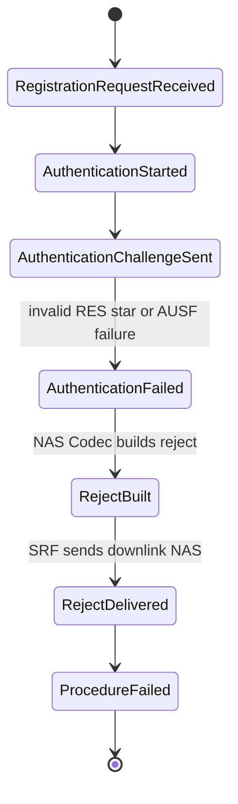

### 7.3 Scenario: Access Restricted

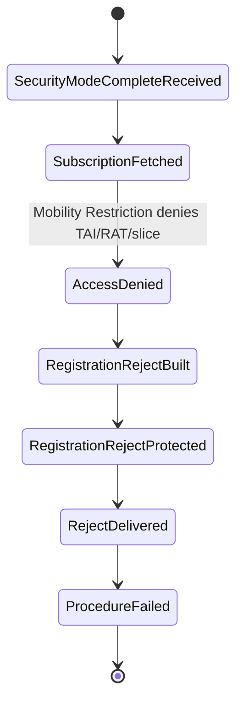

## 8. Initial Proto Contract Sketch

This is not final IDL. It defines the first contract shape.

```proto
syntax = "proto3";

package free6gc.v1;

message ProcedureRef {
  string procedure_id = 1;
  string ran_assoc_id = 2;
  string ran_ue_id = 3;
}

message RanMetadata {
  string plmn_id = 1;
  string tac = 2;
  string cell_id = 3;
  string rat_type = 4;
}

service GcfIngress {
  rpc StartOrContinueProcedure(UplinkNasEvent) returns (GcfIngressResult);
}

message UplinkNasEvent {
  ProcedureRef ref = 1;
  RanMetadata ran = 2;
  bytes nas_pdu = 3;
}

message GcfIngressResult {
  string procedure_id = 1;
  string status = 2;
}

service SrfControl {
  rpc SendDownlinkNas(DownlinkNasCommand) returns (DownlinkNasResult);
  rpc MarkProcedureComplete(ProcedureRef) returns (MarkProcedureCompleteResult);
}

message DownlinkNasCommand {
  ProcedureRef ref = 1;
  bytes nas_pdu = 2;
}

message DownlinkNasResult {
  bool accepted = 1;
}

message MarkProcedureCompleteResult {
  bool accepted = 1;
}
```

Suggested proto files:

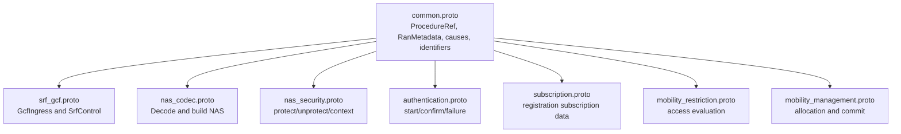

## 9. Codex Session Prompts

### 9.1 SRF Session Prompt

```text
You are implementing free6gc-srf for milestone 1.

Read:
- proposal.md
- free6gc-initial-design.md
- Free5GC AMF NGAP code under NFs/amf/internal/ngap

Task:
Extract or adapt the NGAP/SCTP-facing behavior needed for initial registration.

Rules:
- SRF terminates NGAP/SCTP.
- SRF forwards raw NAS PDUs plus RAN metadata to GCF over gRPC.
- SRF does not decode NAS business semantics.
- SRF owns RAN association and RAN UE routing state.
- SRF exposes a gRPC control API for GCF to send downlink NAS.

Deliverables:
- Compilable service binary.
- Minimal config.
- Unit tests for InitialUEMessage and UplinkNASTransport forwarding.
- Fake GCF test server.
```

### 9.2 GCF Session Prompt

```text
You are implementing free6gc-gcf for milestone 1 initial registration.

Read:
- proposal.md
- free6gc-initial-design.md
- Free5GC AMF GMM registration code under NFs/amf/internal/gmm
- Existing TestInitialRegistrationProcedure in NFs/amf/internal/ngap/registration_procedure_test.go

Task:
Implement the initial registration orchestrator.

Rules:
- GCF owns procedure transaction state.
- GCF calls atomic services over gRPC using static config.
- GCF does not terminate NGAP.
- GCF does not directly parse/build NAS bytes.
- GCF does not own service-local UE contexts.

Deliverables:
- Procedure state machine for successful initial registration.
- gRPC ingress from SRF.
- gRPC clients for NAS Codec, NAS Security, Authentication, Subscription, Mobility Restriction, Mobility Management, and SRF control.
- Unit tests using fake atomic services.
```

### 9.3 NAS Codec Session Prompt

```text
You are implementing free6gc-nas-codec-service for milestone 1.

Read:
- free6gc-initial-design.md
- Free5GC AMF NAS handling and message building code
- github.com/acore2026/nas usage in AMF

Task:
Expose gRPC APIs for decoding and building NAS messages needed by initial registration.

Rules:
- No cryptographic context.
- No procedure state.
- No NGAP.
- Return typed decoded facts to GCF.

Required operations:
- DecodeUplinkNas
- BuildAuthenticationRequest
- BuildSecurityModeCommand
- BuildRegistrationAccept
- BuildRegistrationReject or equivalent error path support
```

### 9.4 NAS Security Session Prompt

```text
You are implementing free6gc-nas-security-service for milestone 1.

Read:
- free6gc-initial-design.md
- Free5GC AMF NAS security code
- Free5GC AMF UE security context code

Task:
Expose gRPC APIs for NAS security context creation, uplink unprotection, and downlink protection.

Rules:
- Service-local in-memory context.
- Keyed by procedure_id/security_context_id.
- Own NAS counts and selected algorithms.
- Do not decode NAS message semantics.

Required operations:
- CreateNasSecurityContext
- ProtectDownlinkNas
- UnprotectUplinkNas
- GetSecurityContextDebugSnapshot for tests
```

### 9.5 Authentication Session Prompt

```text
You are implementing free6gc-authentication-service for milestone 1.

Read:
- free6gc-initial-design.md
- Free5GC AMF AuthenticationProcedure and HandleAuthenticationResponse
- Free5GC AMF AUSF consumer code

Task:
Extract Authentication/SEAF responsibility behind gRPC.

Rules:
- Own auth session state in memory.
- Interact with AUSF or configured test backend.
- Validate RES*/HRES*.
- Confirm auth with AUSF.
- Return SUPI and KSEAF to GCF.

Required operations:
- StartAuthentication
- ConfirmAuthentication
- HandleAuthenticationFailure
```

### 9.6 Subscription Session Prompt

```text
You are implementing free6gc-subscription-service for milestone 1.

Read:
- free6gc-initial-design.md
- Free5GC AMF UDM/SDM consumer paths used during initial registration

Task:
Expose registration subscription retrieval behind gRPC.

Rules:
- Hide UDM/UDR API details from GCF.
- Return only data needed by initial registration.
- Service-local cache is allowed but not required.

Required operation:
- FetchRegistrationSubscriptionData
```

### 9.7 Mobility Restriction Session Prompt

```text
You are implementing free6gc-mobility-restriction-service for milestone 1.

Read:
- proposal.md
- free6gc-initial-design.md
- Free5GC AMF registration restriction/policy handling paths

Task:
Expose access evaluation behind gRPC.

Rules:
- Decide allowed/denied for TAI, RAT, and requested NSSAI.
- Return allowed NSSAI and rejection cause when denied.
- Do not allocate GUTI or registration area.

Required operation:
- EvaluateAccess
```

### 9.8 Mobility Management Session Prompt

```text
You are implementing free6gc-mobility-management-service for milestone 1.

Read:
- free6gc-initial-design.md
- Free5GC AMF registration area, GUTI, and registration commit paths

Task:
Expose registration context allocation and commit behind gRPC.

Rules:
- Own GUTI allocation and TAI list assignment.
- Own committed registration context in memory.
- Do not evaluate access permission.
- Do not perform NAS encoding.

Required operations:
- AllocateRegistrationContext
- CommitRegistration
- GetRegistrationDebugSnapshot for tests
```

## 10. Immediate Work Plan

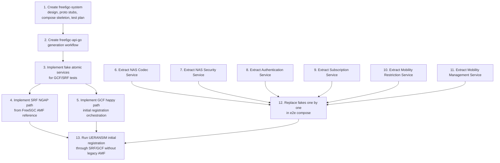

## 11. Open Questions

These are intentionally left for later review:

1. Should milestone 1 use mTLS between services, or plaintext gRPC on an isolated Docker network?
2. Should `free6gc-api-go` be generated in CI only, or checked in for easier Codex sessions?
3. Should service-local memory be reset by admin API for tests?
4. Should GCF transaction logs be persisted to disk for replay in milestone 1?
5. How much of NRF remains in milestone 1 if GCF uses static config?
6. Should PCF be included in the happy path, or deferred until access restriction/policy tests require it?
7. Should Registration Complete trigger UE context release behavior in milestone 1, or just commit registration?
