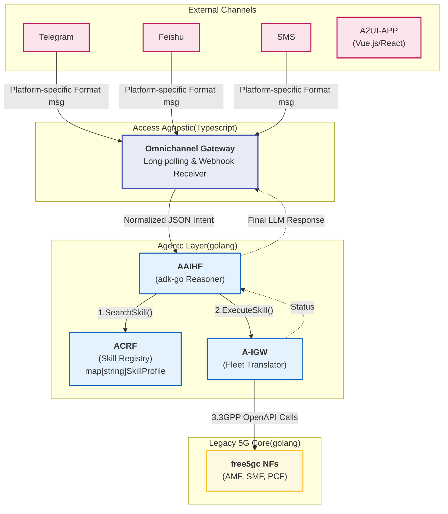
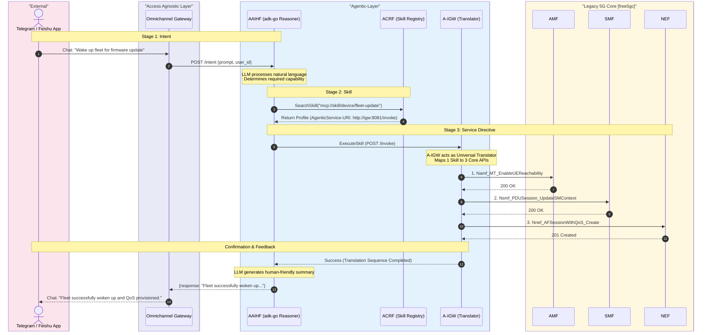
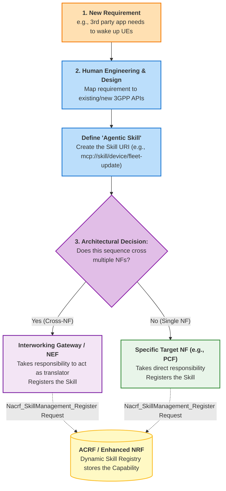

# 逻辑视图

1. 先只对接Telegram（OTT即时通信领域）和SMS（IMS领域），飞书对接需要域名、HTTPS和证书，暂不具备条件
2. Google提案中提到的A2UI-APP，目前Telegram等应用都不支持，需要单独开发应用（用Vue或者React）

# 第一阶段实现设计

## 流程演绎

1. ACRF实现简化：其注册表用一个简单的`map[string]SkillProfile`，只能做字符串匹配，没法实现语义搜索。
2. AAIHSF实现简化：第3步SearchSkill时，直接使用`mcp://skill/device/fleet-update`。正常来说，应该携带required-skill=`ensure-device-reachability` or `mcp://skill/wake-up-devices`

# Skill注册流程演绎

